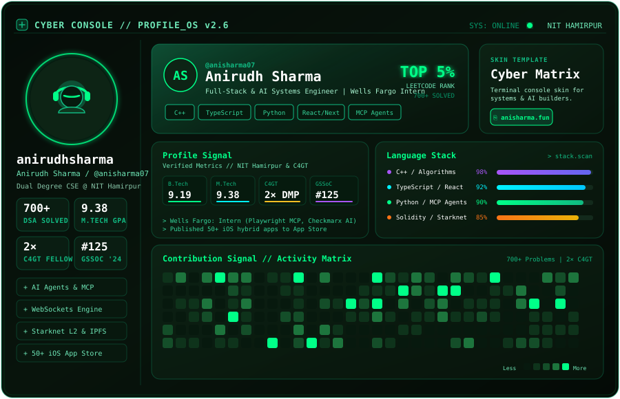

<div align="center">

<!-- ═══════════════════════════════════════════════════════════════ -->
<!--               GITSKINS CYBER PROFILE CONSOLE                    -->
<!-- ═══════════════════════════════════════════════════════════════ -->

<a href="https://anirudh-sharma.fun">
  
</a>

<!-- Real-Time Telemetry Badges -->
<p align="center">
  <a href="https://anirudh-sharma.fun"></a>
  <a href="https://www.linkedin.com/in/anisharma002/"></a>
  <a href="https://leetcode.com/u/its_ani/"></a>
  <a href="https://codeforces.com/profile/i_am_ani"></a>
  
</p>

</div>

---

### ⚡ Core Tech Arsenal

<div align="center">

<a href="https://anirudh-sharma.fun">
  
</a>
<br/>
<a href="https://anirudh-sharma.fun">
  
</a>

<br/><br/>

```text
[ SYSTEM PROFICIENCY TELEMETRY ]
C++ & Algorithmic Optimization (DSA)   [████████████████████] 98%  // LeetCode Top 5% (700+ Solved)
Full-Stack Web (React, Next.js, TS)    [██████████████████░░] 92%  // High-Throughput & SSR
Autonomous AI Agents & MCP Protocol    [██████████████████░░] 90%  // Tool Calling & LLMs
Mobile Systems (iOS, Capacitor, RN)    [████████████████░░░░] 88%  // 50+ App Store Releases
Cloud & DevOps (Docker, CI/CD, AWS)    [████████████████░░░░] 85%  // Automated Pipelines
```

</div>

---

### 🚀 Featured Deployments & Architectures

| Deployment | Tech Stack | Engineering Highlights | Source / Demo |
| :--- | :--- | :--- | :--- |
| **ScheduleX** | `React Native` `Gemini AI` `Firebase` | LLM-driven automated timetable orchestration engine boosting scheduling velocity by 70% with offline sync. | [📦 Repo](https://github.com/anisharma07/React-native-attendance-app) • [📥 APK](https://github.com/anisharma07/React-native-attendance-app/releases/download/v1.0.3/app-release.apk) |
| **Socialcalc MCP** | `MCP Protocol` `TypeScript` `AWS S3` | Model Context Protocol server enabling LLMs to query and mutate enterprise spreadsheets in real time. | [🏢 C4GT Org](https://github.com/anisharma07) |
| **nftOS Marketplace** | `Next.js` `Solidity` `IPFS` `MongoDB` | L2 digital asset platform with real-time MongoDB sync cutting query latency by 90% via IPFS Pinata. | [🌐 Live Platform](https://nftos.in) |
| **TypeDash Engine** | `Node.js` `Socket.io` `Docker` | Real-time typing battle engine handling 500+ concurrent connections with sub-50ms latency. | [📦 Repo](https://github.com/Teamexe/Type-Dash) • [🎮 Demo](https://anisharma07.github.io/kangarooType/) |
| **Atmospheric Portfolio** | `React` `TypeScript` `Web Audio API` | Immersive web experience with procedural Web Audio sound synthesis, custom particle canvas, and AI Assistant. | [🌐 Live Site](https://anirudh-sharma.fun) • [📦 Repo](https://github.com/anisharma07) |

---

### 🛰️ Live Telemetry & Activity Pulse

<div align="center">

<table width="100%" border="0">
  <tr>
    <td width="50%" align="center" valign="middle">
      <a href="https://leetcode.com/u/its_ani/">
        
      </a>
    </td>
    <td width="50%" align="center" valign="middle">
      <a href="https://github.com/anisharma07">
        
      </a>
    </td>
  </tr>
</table>

<br/>

<picture>
  <source media="(prefers-color-scheme: dark)" srcset="https://raw.githubusercontent.com/anisharma07/anisharma07/output/github-contribution-grid-snake-dark.svg">
  <source media="(prefers-color-scheme: light)" srcset="https://raw.githubusercontent.com/anisharma07/anisharma07/output/github-contribution-grid-snake.svg">
  
</picture>

</div>

---

### 📡 Secure Uplink & Network

<div align="center">

<p>
  <a href="https://anirudh-sharma.fun">
    
  </a>
  &nbsp;
  <a href="https://www.linkedin.com/in/anisharma002/">
    
  </a>
  &nbsp;
  <a href="https://leetcode.com/u/its_ani/">
    
  </a>
</p>

<p>
  <a href="https://codeforces.com/profile/i_am_ani">
    
  </a>
  &nbsp;
  <a href="https://x.com/SharmaAni236">
    
  </a>
  &nbsp;
  <a href="mailto:anisharma0010@gmail.com">
    
  </a>
</p>

<br/>

```text
[EOF] ~ root@anirudh:~$ echo "Building resilient, autonomous & high-throughput software."
```

</div>
